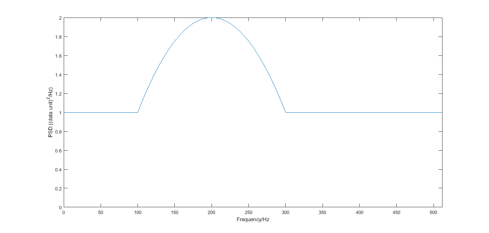
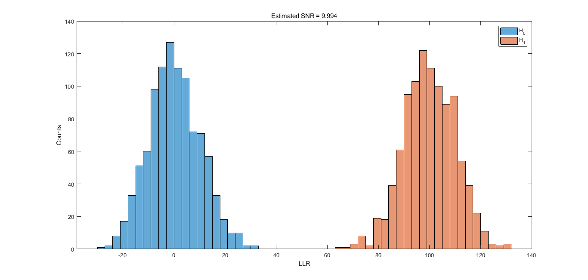
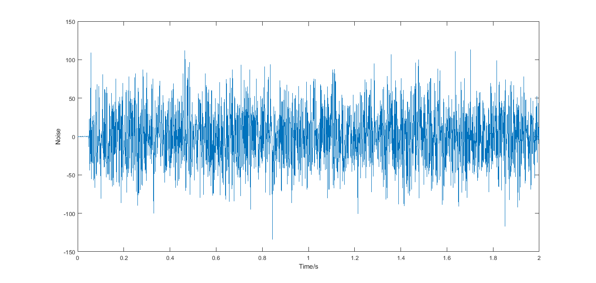
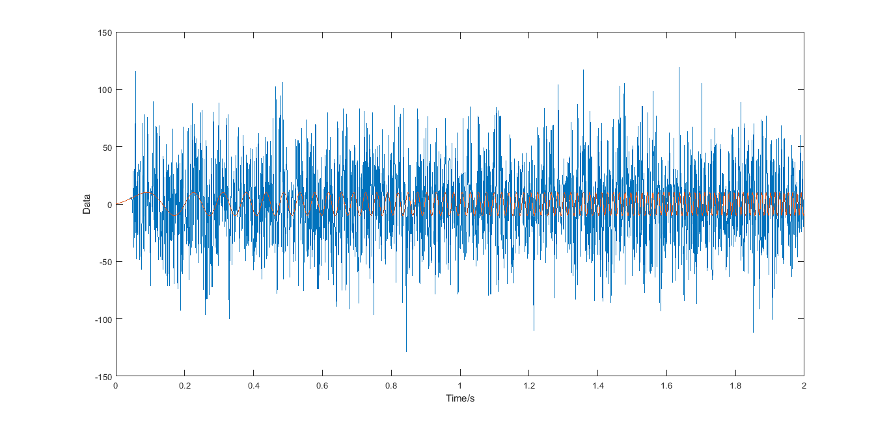
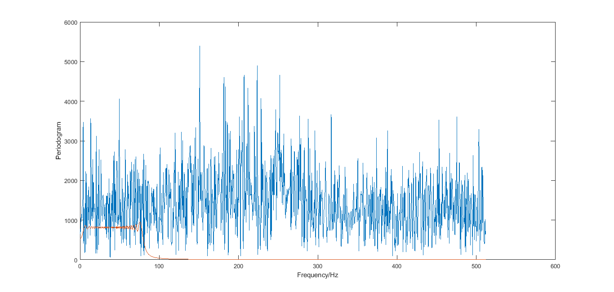
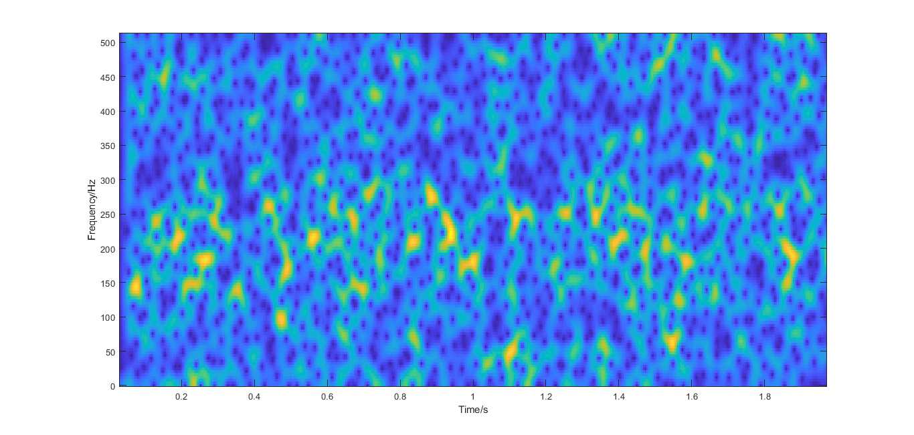
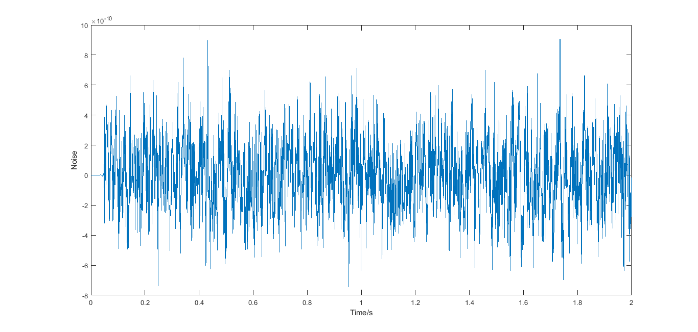
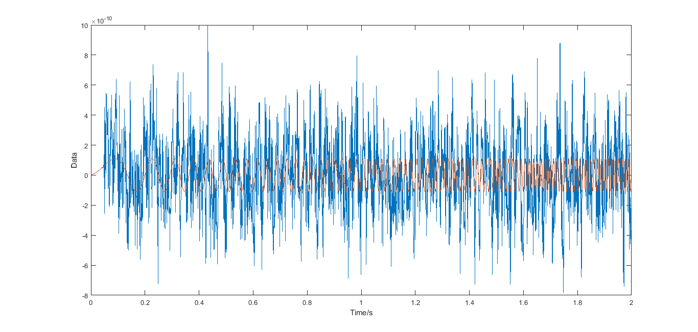
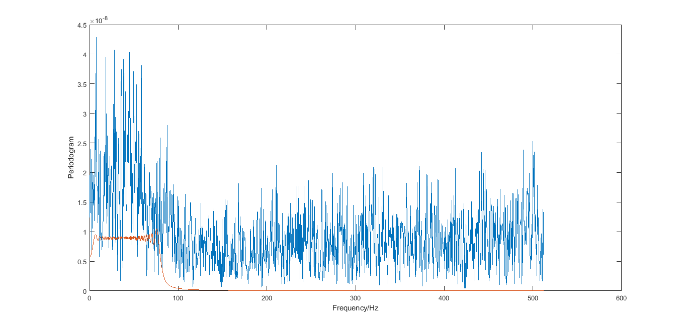
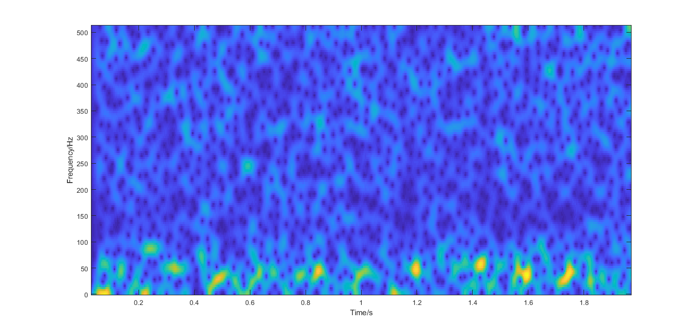

# Topic 4: Detection and Estimation of Signals in Noise

## Task 1: Use the Quadratic Noise PSD and Linear Chirp Signal

### PSD Shape



### Estimated SNR



### Noise Realization



### Data and Signal Realization



### Periodogram of Data and Signal



### Spectrogram of Data



## Task 2: Use the Initial LIGO Design Sensitivity PSD and Linear Chirp Signal

### PSD Shape


### Estimated SNR


### Noise Realization



### Data and Signal Realization



### Periodogram of Data and Signal



### Spectrogram of Data



## Task 3: Write a Function to Calculate the GLRT

### Here is the code [glrtqcsig.m](glrtqcsig.m).

## Task 4: Estimating Significance

### Using [significance.m](significance.m), we can get the following results for 10000 times data realization.

```MATLAB
For data1, the significance under H0(signal absent) is 0.0012, 
which means the probability being a pure noise is 0.12%, 
and the probability having a signal is 99.88%.

For data2, the significance under H0(signal absent) is 0, 
which means the probability being a pure noise is 0%, 
and the probability having a signal is 100%.

For data3, the significance under H0(signal absent) is 0.0904, 
which means the probability being a pure noise is 9.04%, 
and the probability having a signal is 90.96%.
```
