## 任务1
### 信号产生
#### AMFM信号
这次任务中我们选择了AMFM信号:
$$
s(t) = A \cos(2 \pi f_2 t) \sin(2 \pi f_0 t + b \cos(2 \pi f_1 t))
$$
信号波形, 如下:

通过快速傅里叶变换
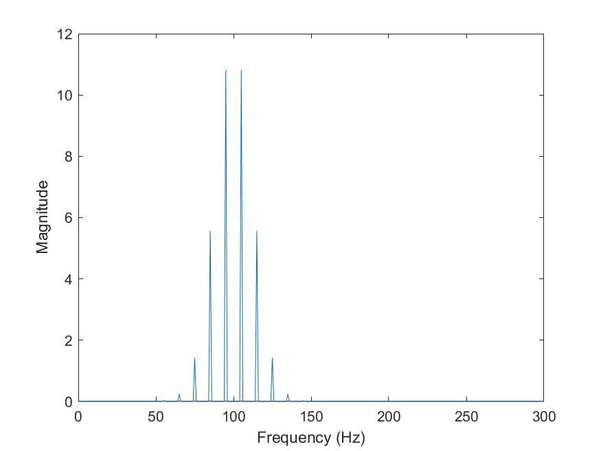

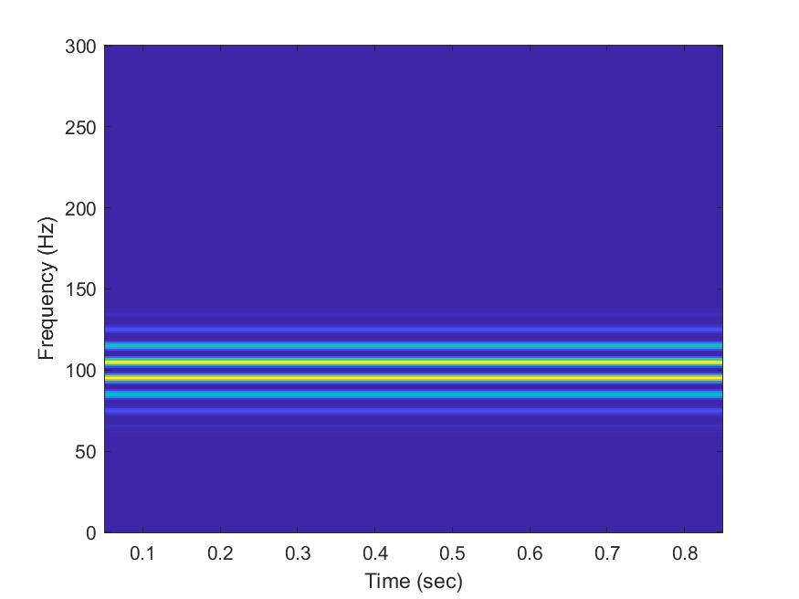

#### Sine-Guassian signal 
$$
s(t) = A \cos(2 \pi f_2 t) \sin(2 \pi f_0 t + b \cos(2 \pi f_1 t))
$$
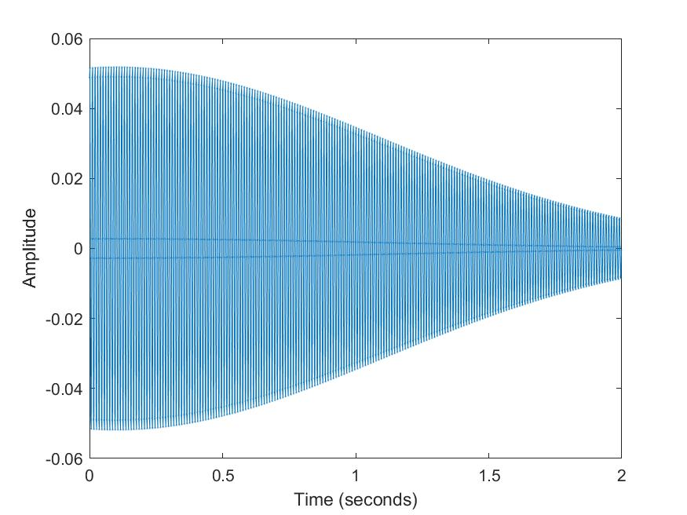
快速傅里叶变换后的结果
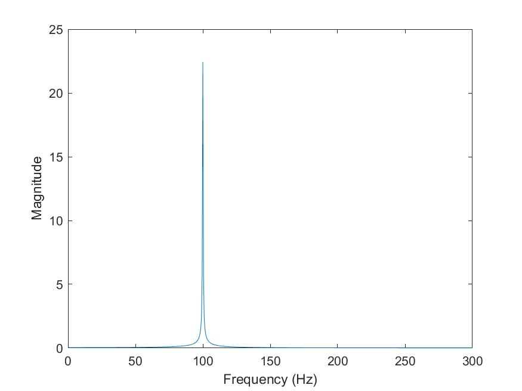
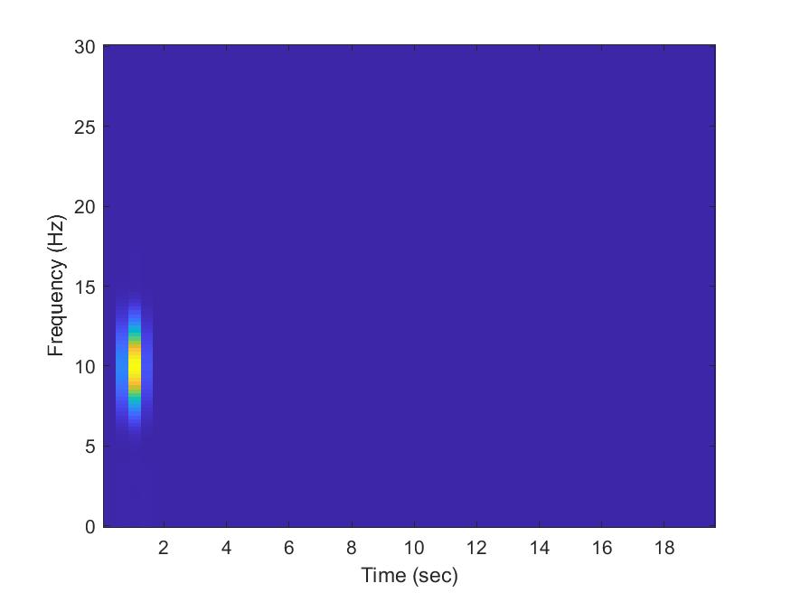

####  Step FM
$$
s(t) = 
\begin{cases}
A \sin(2 \pi f_0t) & if: t \leq t_a\\
A \sin(2 \pi f_1 (t-t_a)+2 \pi f_0 t_a) & if: t > t_a
\end{cases}
$$

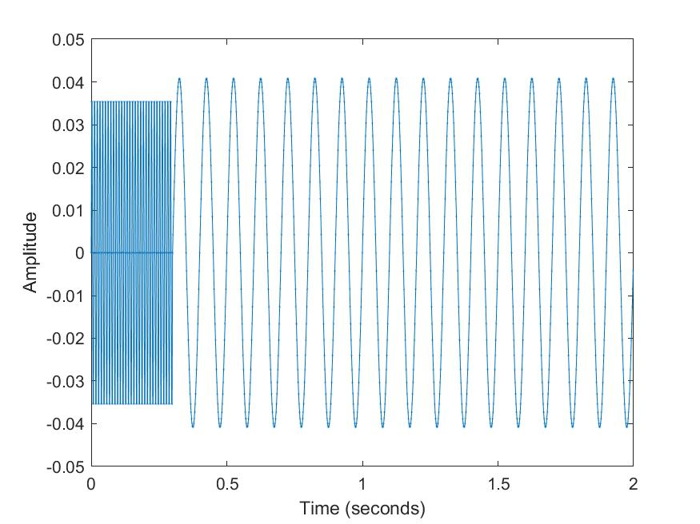

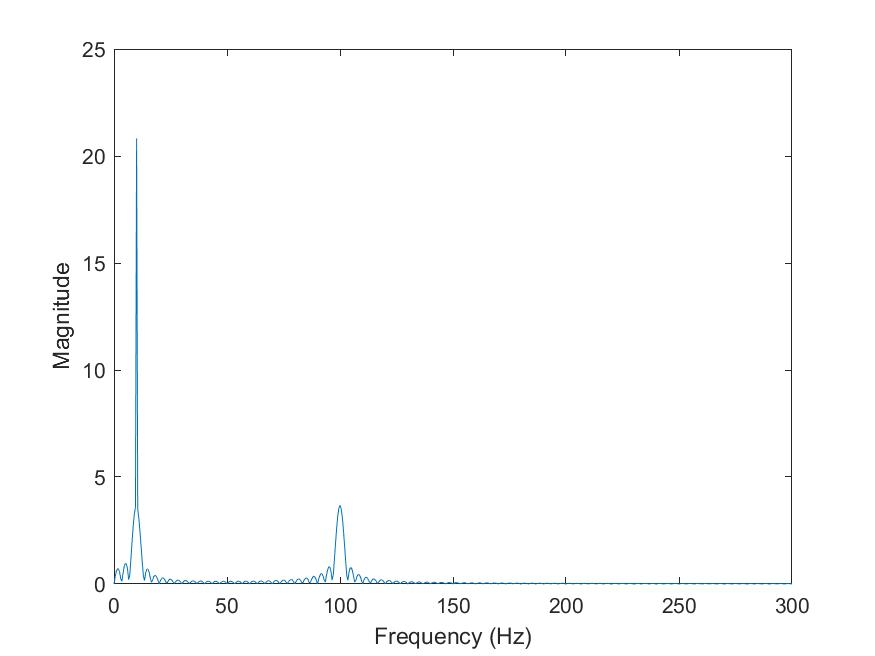

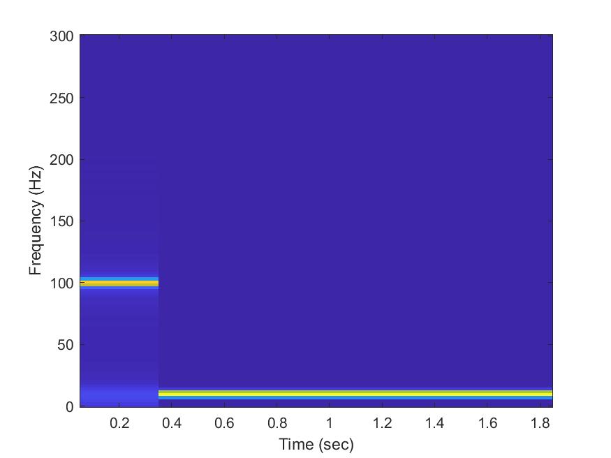

## 滤波
### 信号源
$$
s(t)= \sin(2 \pi f_1 t + \phi_1) + \sin(2 \pi f_2 t + \phi_2)+
    sin(2 \pi f_2 t + \phi_2);
$$

### 低通滤波器的设计
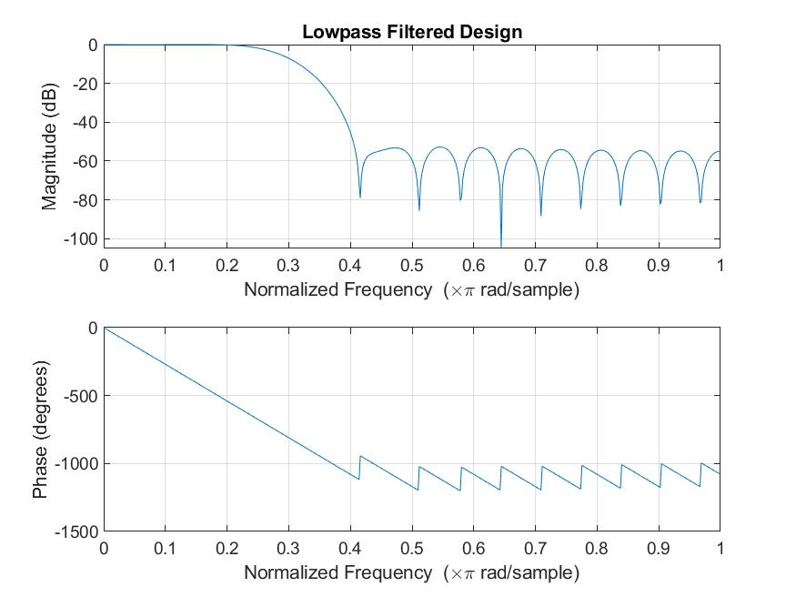

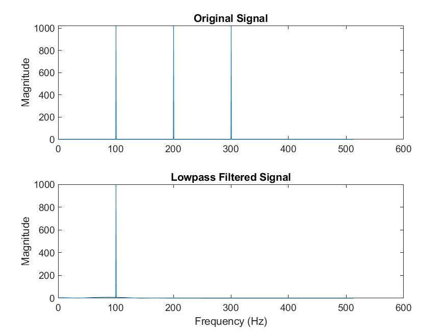

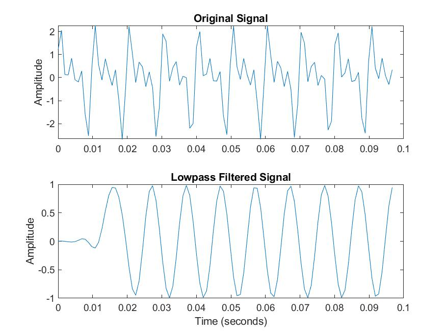
### 带通滤波器的设计
带通
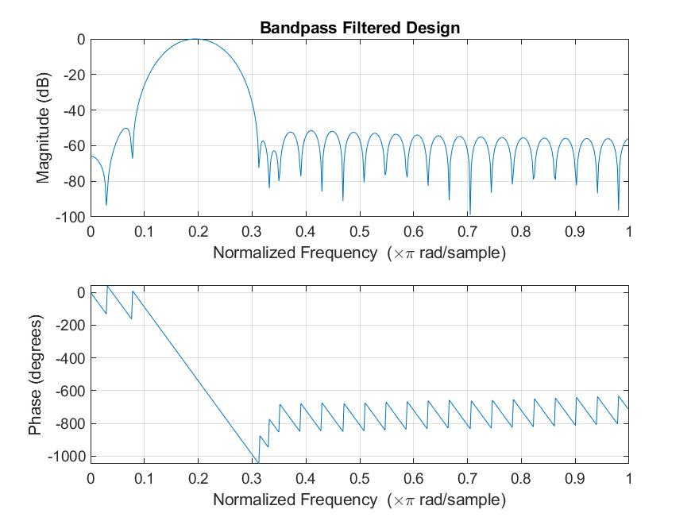

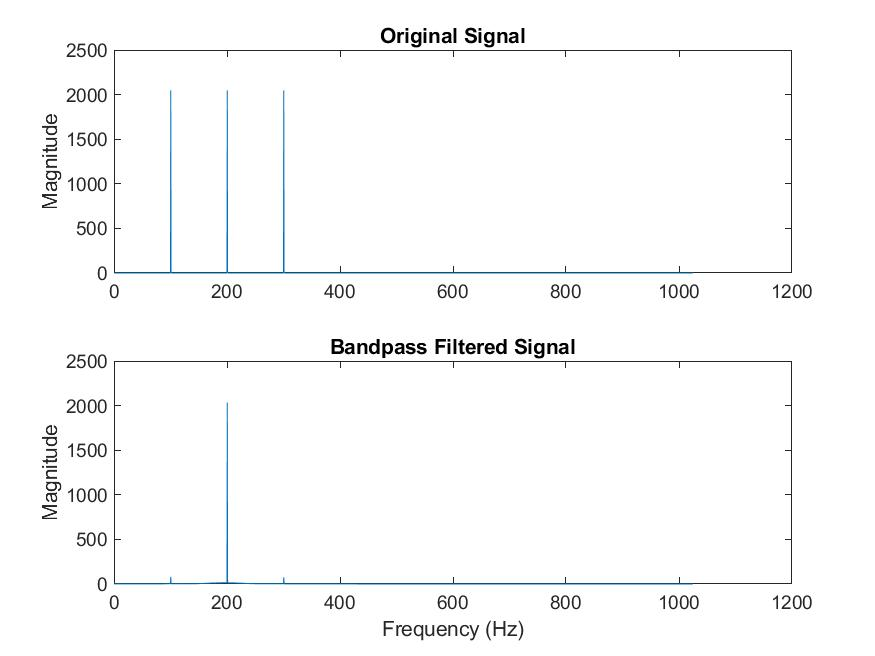

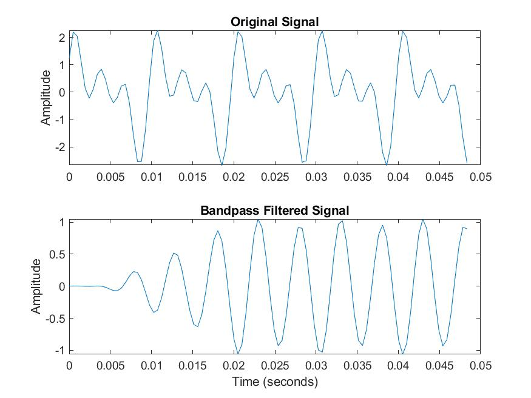

### 高通滤波器的设计
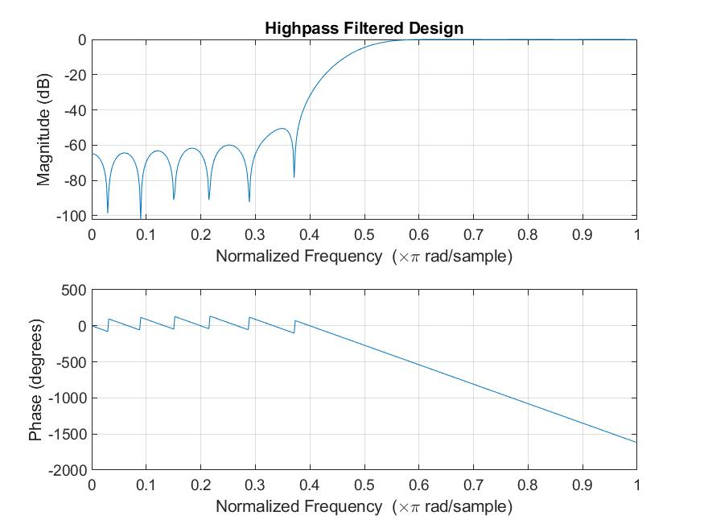

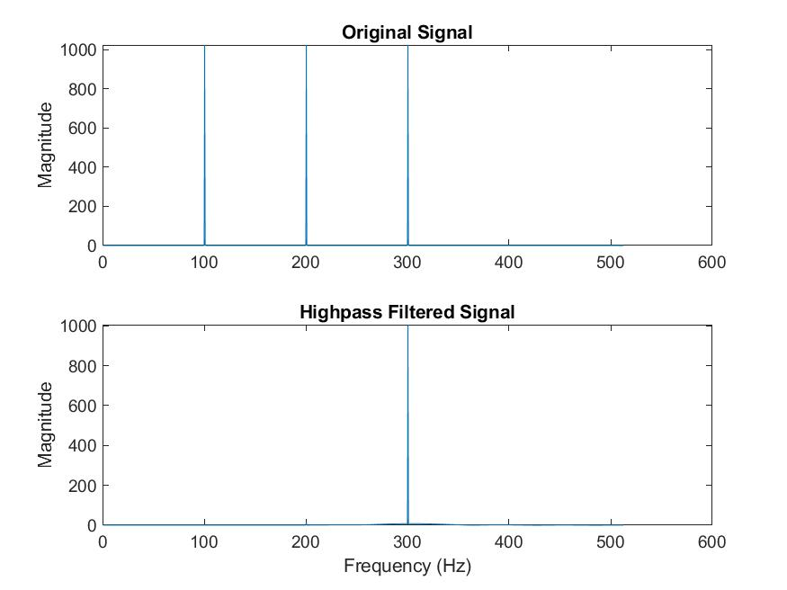

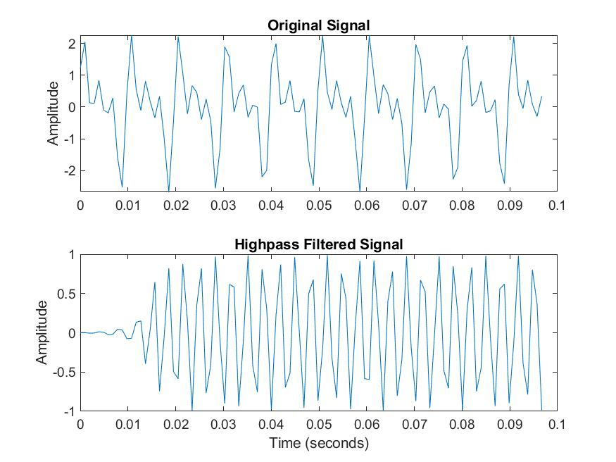
