## Part 1
-----------
### 学习目标
- 伪随机数(Pseudo-random numbers)
- Matlab函数生成(伪随机)试验值从一些标准单变量PDFs
- 使用用户指定的参数从pdfs中绘制试用值
- 绘制直方图(histograms)来估计pdfs(概率密度)
-------------------
### 伪随机数
- 伪随机数：当你在计算机上生成一个随机数时，它实际上是在遵循一个确定性的算法来生成一个看起来是随机的数字
- 伪随机数生成器(PRNG)需要一个起始种子值：当重置种子时，PRNG返回与之前相同的随机数序列
- 家庭作业阅读：找到一个在线资源，了解随机数是如何在计算机上产生的
-----------------------
### 实验任务
- 编写一个测试脚本testcustomprng.m:
1. 使用customrand和customrandn函数分别从其中生成10,000个试验值
 > 1.  $U(x;-2,1)$
>  2. $N(x;1.5,2.0)$
2. 为每种情况做标准化的直方图
3 .在每个直方图的顶部，绘制上面各自的pdf文件
4. 提交代码和图片

#### 1. 正态概率密度分布
$$
N(x;a,b)=\frac{1}{\sqrt{2 \pi} a} e^{\left(-\frac{(x-b)^2}{2 a^2}\right)}
$$
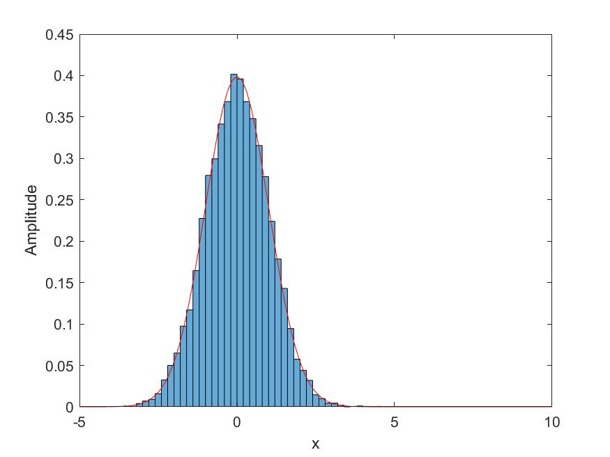
#### 2.均匀概率密度分布
$$
U = 
\begin{cases}
\frac{1}{b-a} & if: a \leq x \leq b\\
0 & if: otherwise
\end{cases}
$$
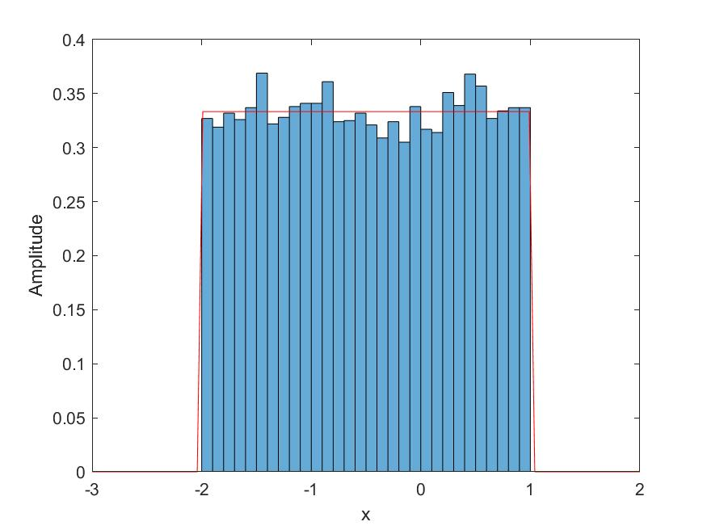


## Part 2
### 学习目标
- 使用Weiner-Khinchin 定律产生有色高斯噪声
- 使用Welch的模型估计功率谱密度
- 学习如何使用数据变白(whiten)(有色高斯噪声变白高斯噪声)

### 有色高斯噪音
1. 目标功率谱密度

2. 归一化目标功率谱密度

3. 输出噪声功率谱密度

4. 输出噪声


**比较**
白高斯噪音


### 学习目标
- 利用维纳-欣钦定理(Weinner-Khinchin theorem)生成高斯有色噪声
- 利用Welch's 模型估计功率谱密度
- 学习如何Whiten给定数据

### 任务
- 你已经在NOISE文件夹中得到了一个纯文本文件:"testData.txt":
1. 第一栏: 样本时间
2. 第二栏: 数据值
- 数据包含:
1. 一种实现有色高斯噪声+...
2. 在t= 5.0秒后增加一个神秘的信号
- 你可以使用load('testData.txt')来加载数据文件。Matlab使用文件扩展名'.txt'来识别这是一个纯文本文件。
- 使用无信号部分的数据:
1. 估计噪声PSD
2. 利用估计的PSD并在"NOISE/ statgaussnoisegen.m"中仿真代码来设计一个白化滤波器
- 然后白话数据
- 绘制绘制白化前后数据的spectrograms
- 绘制白化前后的data time series 
白化后的数据中是否有更清晰的信号存在?

1. 采集0-5s时间段的信号
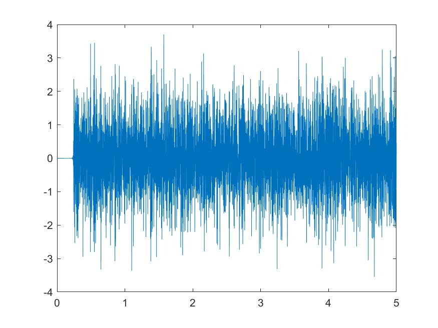

2. 绘制0-5s内的功率谱密度, 并给出功率谱密度拟合曲线
 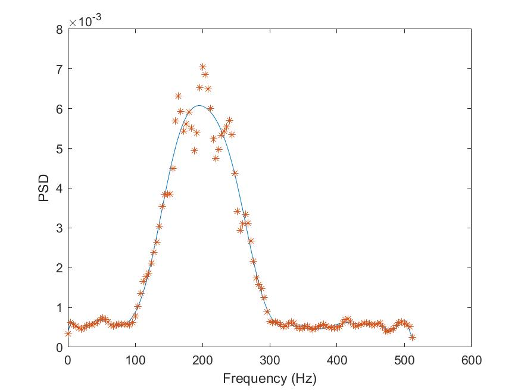

3. 白化信号,对比白化信号前后时间频率图
白化前
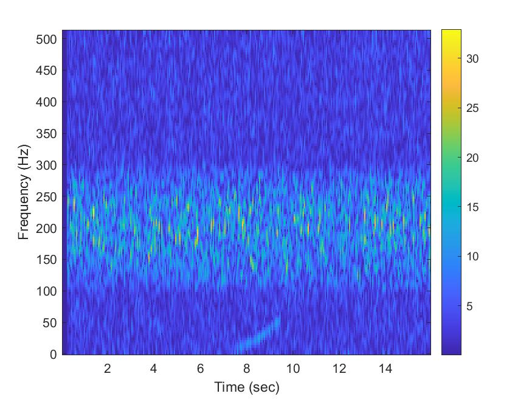
白化后
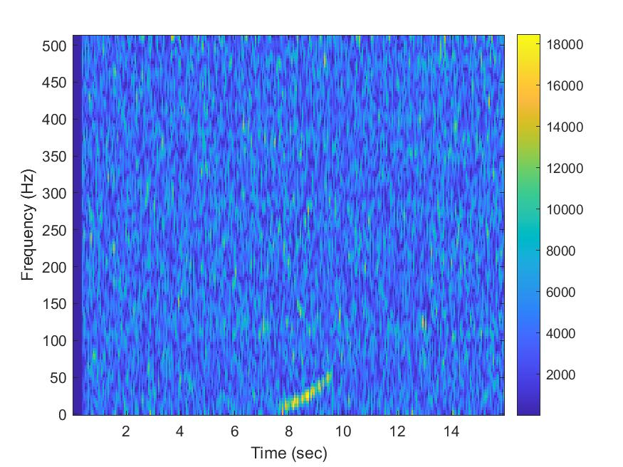
白化前信号
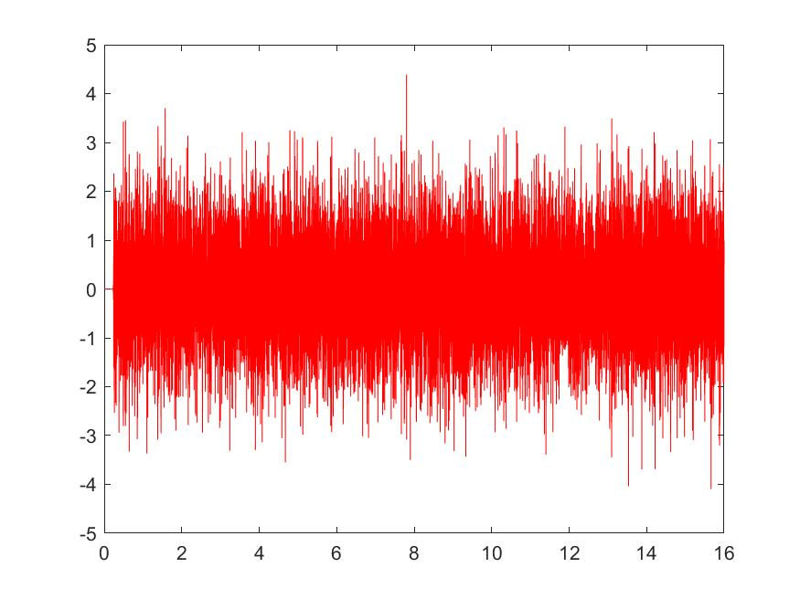

白化后信号
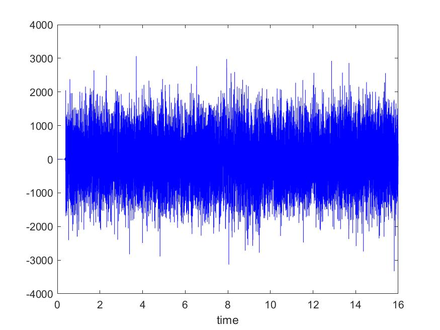

## Part3
### 学习目标
- 模拟干涉检测器的噪声
- 我们将选取初始LIGO探测器的灵敏度曲线作为目标PSD的例子
- 同样的步骤可以用于任何其他设计灵敏度曲线(如先进的LIGO, LISA等)


### 任务3:修改
目标PSD曲线 
```matlab
y = load('iLIGOSensitivity.txt','-ascii');
freq =y(:,1);
PSD = (y(:,1)>50&y(:,1)<700).*y(:,2)+(y(:,1)<50).*y(sum((y(:,1)<50)),2)...
    +(y(:,1)>700).*y(length(y(:,1))-sum((y(:,1)>700)),2);
```
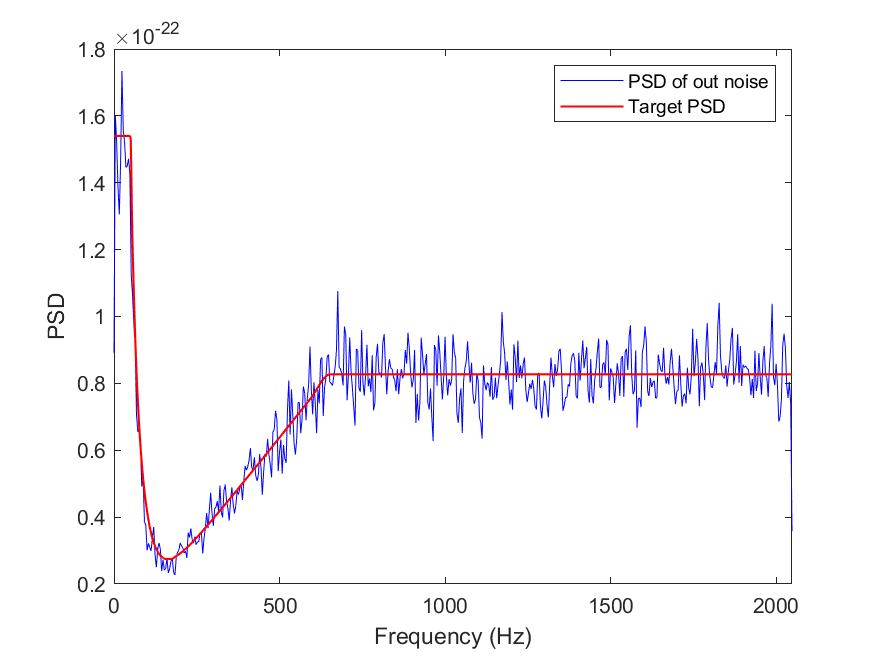
红线为我们的目标噪音的功率谱密度
蓝线为我们获得的噪音的功率谱密度

1. 下图为白化前的时间频率图
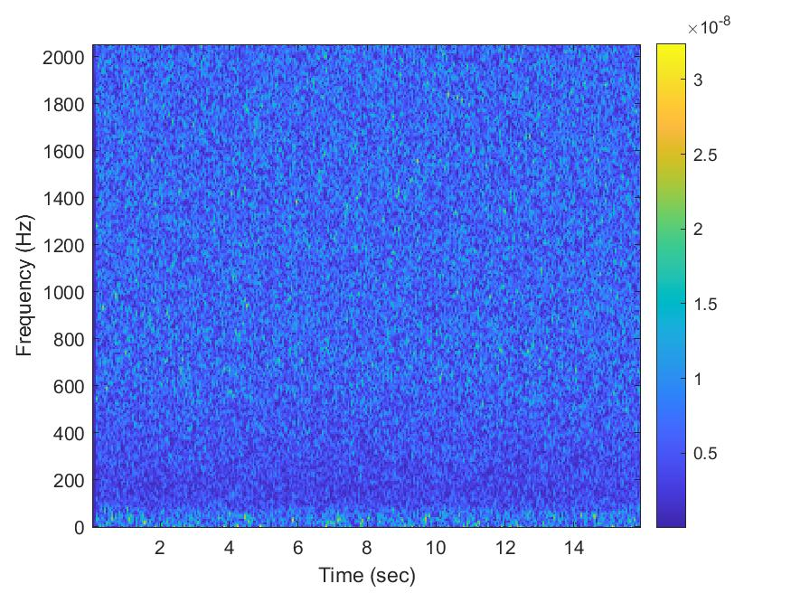

2. 下图为白化后的时间频率图
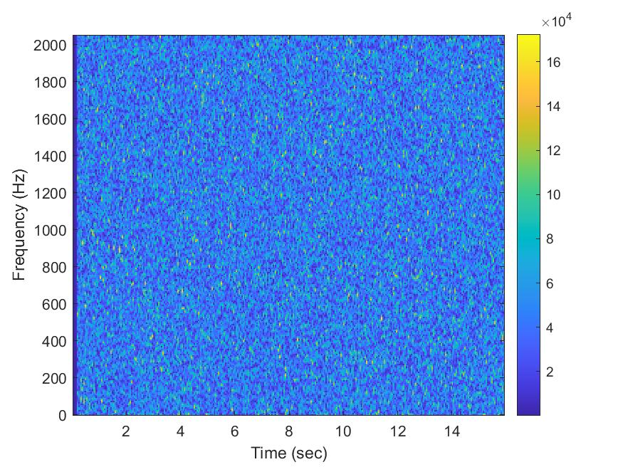


